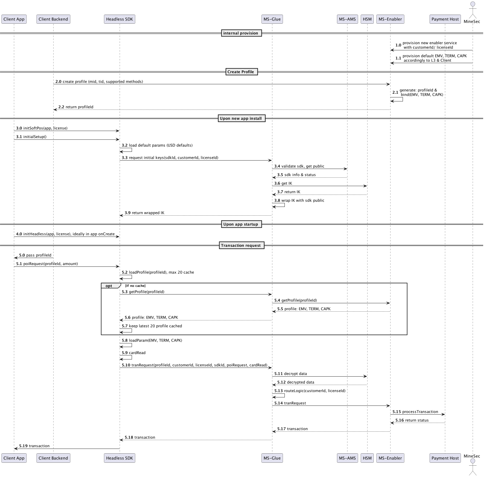

# MineSec Headless SDK Integration Example

## Introduction

2 primary entities for Headless SDK consumer (aka Business App, client app, consumer app etc):

- `HeadlessSetup` an object for non-UI setup
    - Init SoftPOS: init MPoC/ MineHades with app & license
    - Initial Setups: load local default EMV, TERM, CAPK and get IK from remote
- `HeadlessActivity`: a base component class for consumer to impl
    - Provide default theme & UI: provide UI element for the card reading UI
    - Internally connected to Glue layer for `PoiRequest` handling

[API Definition here](https://theminesec.github.io/ms-sdk-headless/)

## Overview

## Error code

For `WrappedResult.Failed`.`code`, enum class available @ `HeadlessError`

#### (40_xxx) initialization & setups error

| name              | code   | default message                           |
|-------------------|--------|-------------------------------------------|
| InitSoftPosError  | 40_000 | "Exception during SoftPOS initialization" |
| SetupSoftPosError | 40_001 | "Exception during SoftPOS setup"          |
| NoDefaultConfig   | 40_002 | "No default configuration"                |

#### (41_xxx) preparing request error

| name                        | code   | default message                  |
|-----------------------------|--------|----------------------------------|
| ParsingActivityResultFailed | 41_001 | "Parsing activity result failed" |
| ProfileNotFound             | 41_002 | "Cannot get payment profile"     |

#### (42_xxx) during card read error

| name                              | code   | default message                  |
|-----------------------------------|--------|----------------------------------|
| AbortedCardDetectionTimeout       | 42_001 | "Card detection timeout"         |
| AbortedManually                   | 42_002 | "Manual abort transaction"       |
| AbortedCardReadRetryCountExceeded | 42_003 | "Card read retry count exceeded" |

#### (43_xxx) network error

| name              | code   | default message                  |
|-------------------|--------|----------------------------------|
| ConnectionTimeout | 43_001 | "Connection to upstream timeout" |

#### (49_xxx) other source error

| name                 | code   | default message                                                                          |
|----------------------|--------|------------------------------------------------------------------------------------------|
| ResultNull           | 49_000 | "This is an unlikely error, during result processing it is null, please contact support" |
| OtherSourceError     | 49_001 | "Error from other source"                                                                |
| OtherSourceException | 49_002 | "Exception from other source"                                                            |
